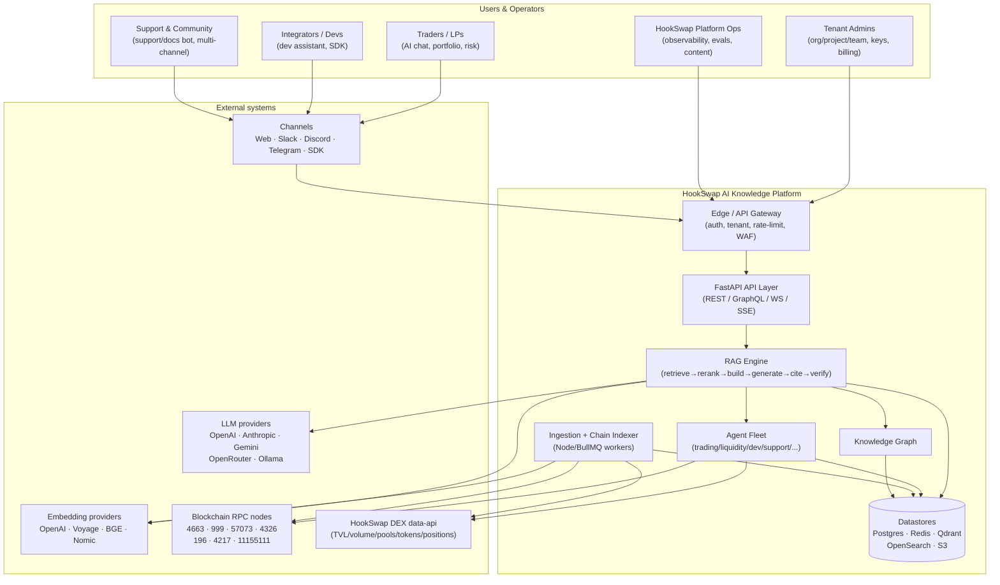
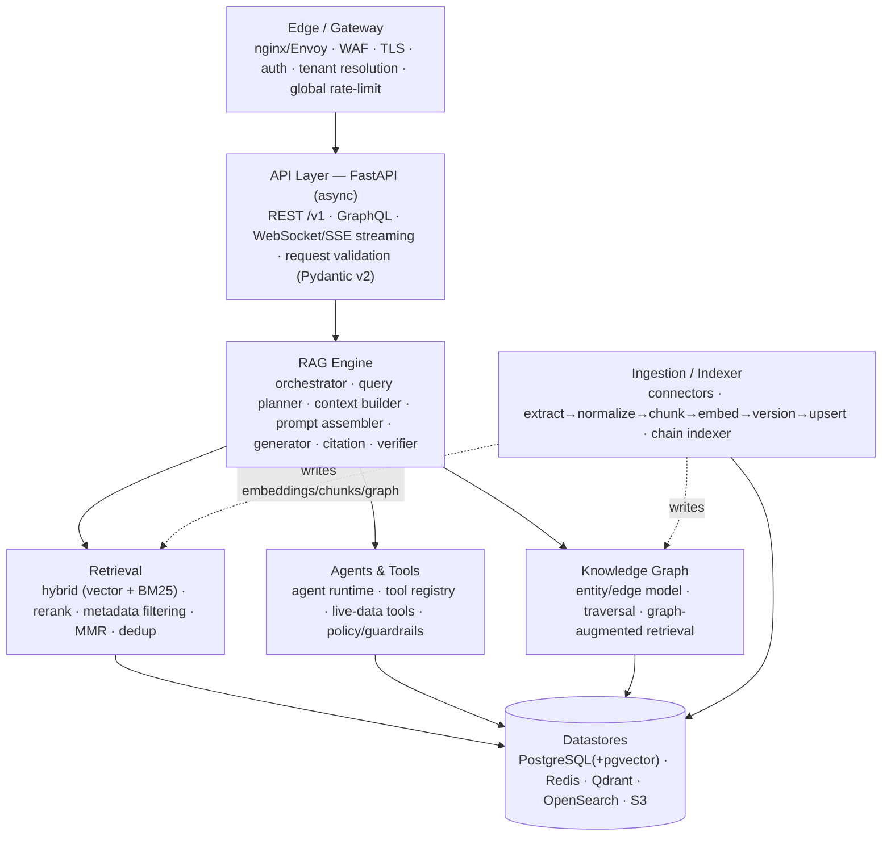
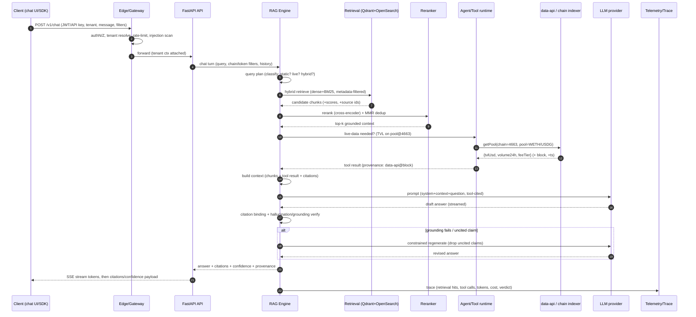
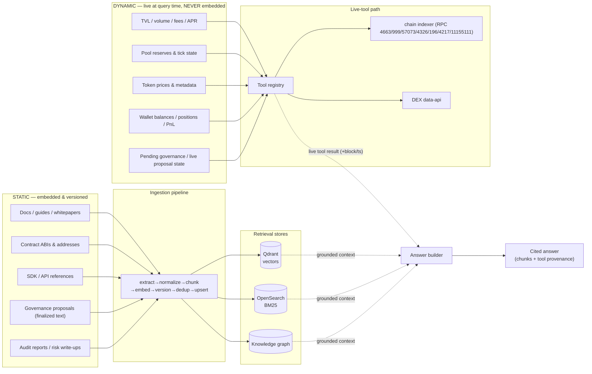
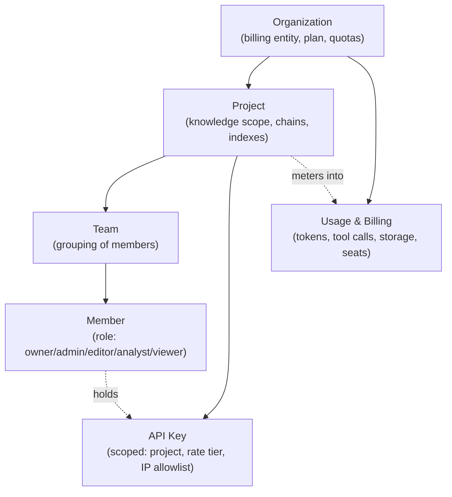

# 01 — System Architecture

**Purpose.** This document is the master architecture specification for the **HookSwap AI Knowledge Platform** — the enterprise, multi-tenant RAG / AI Knowledge Layer that powers every AI feature of the HookSwap multi-chain DEX: semantic search, AI chat, the trading / dev / support / governance assistant fleet, liquidity & risk analytics, launchpad support, marketing generation, and autonomous agents. It defines the system context, the layered internal architecture, the request/response flow for a grounded chat query, the static-vs-dynamic knowledge split, the multi-tenancy model, the full service inventory, and the cross-cutting concerns (observability, security, caching, rate limiting, scalability, HA) that every service must honor. It is the entry point for the sibling specs: folder layout in `02-folder-structure.md`, the relational + graph data model in `03-database-schema.md`, RAG internals in `04-rag-engine.md`, retrieval in `05-retrieval-and-ranking.md`, the agent framework in `06-agents-and-tools.md`, ingestion in `07-ingestion-pipeline.md`, the chain indexer & live-data tools in `08-chain-indexer-and-live-data.md`, tenancy/RBAC/billing in `09-multi-tenancy-and-rbac.md`, security in `10-security-and-compliance.md`, observability in `11-observability.md`, and deployment in `12-deployment-and-infra.md`.

The design is opinionated and non-negotiable on five core principles, and every section below ties back to them:

1. **Grounded, never fabricated.** Every answer is produced from retrieved sources or live tool calls, and carries citations, a confidence score, and a hallucination-detection verdict. The HookSwap *facts-only* rule is enforced in code, not by convention: any stat, address, or number must be traceable to a retrieved chunk or a live tool result.
2. **Static vs dynamic knowledge.** Docs, whitepapers, and ABIs are embedded (static, versioned) into the vector/lexical stores. TVL, volume, pool state, wallet balances, and prices are **never embedded** — they are pulled live at query time through the chain indexer and the DEX `data-api` tools, so numbers are always current and real.
3. **Multi-tenant from day one.** Organizations → Projects → Teams → RBAC → API keys → usage/billing, isolated at every layer.
4. **Chain-, wallet-, and time-aware retrieval.** Every query carries metadata filters (chain / protocol / pool / token / contract / version / date / risk).
5. **Sepolia-first.** Any contract the platform itself deploys (e.g. attestation or usage-metering helpers) is proven on Sepolia (`11155111`) before any production chain.

The canonical live-chain set the platform serves is fixed in `packages/chains/chains.ts` (mirroring the DEX `contracts/deployments/*.json`): **Robinhood (4663, primary)**, **HyperEVM (999)**, **Ink (57073)**, **MegaETH (4326)**, **XLayer (196, gas in OKB)**, **Tempo (4217, gas in pathUSD)**, and **Sepolia (11155111, mandatory validation chain)**. The DEX ships **v2 + v3 only** (`supportsV4: false`) — there are no hooks/v4 features to describe. New chains are onboarded by registry + adapter config alone (see `08-chain-indexer-and-live-data.md`).

---

## 1. System context

The platform sits between HookSwap end users / operators and three classes of external systems: LLM & embedding providers, blockchain RPC nodes, and the DEX's own `data-api`. It never talks to end-user wallets directly and never signs transactions — it is a **read + reason + cite** layer.

**Trust boundaries.** The Edge/Gateway is the only ingress; all provider egress (LLM, embeddings, RPC, data-api) is brokered through server-side abstractions with per-tenant credentials and quotas — clients never hold provider keys. RPC and `data-api` are treated as **untrusted, live** sources: their outputs are surfaced as tool results with provenance, never blended into embedded knowledge.

---

## 2. Layered architecture

The platform is a strict, downward-only dependency stack. Higher layers call lower layers; lower layers never import higher layers. This keeps the RAG core testable in isolation and lets the ingestion tier scale independently of the request path.

- **Edge / Gateway (L0).** Terminates TLS, applies the WAF ruleset (prompt-injection heuristics at the HTTP edge, payload caps), resolves the tenant from the API key / JWT, and enforces the coarse global rate limit before any compute. See `10-security-and-compliance.md`.
- **API Layer — FastAPI (L1).** Fully async. Exposes REST under `/v1`, a GraphQL surface for the dashboards, and WebSocket/SSE for streaming tokens and agent step events. All I/O is Pydantic v2 validated. Owns request-scoped tenant context and idempotency keys.
- **RAG Engine (L2).** The heart of principle #1: orchestrates the retrieve→rerank→build→generate→cite→verify pipeline described in §4. Detailed in `04-rag-engine.md`.
- **Retrieval (L3).** Hybrid dense+sparse retrieval with cross-encoder reranking and mandatory metadata filtering (principle #4). Detailed in `05-retrieval-and-ranking.md`.
- **Agents & Tools (L4).** The agent runtime and tool registry that turn a question needing *live* numbers into `data-api` / chain-indexer calls (principle #2). Detailed in `06-agents-and-tools.md`.
- **Knowledge Graph (L5).** Entities and edges across chains↔protocols↔tokens↔pools↔wallets↔governance↔contracts, used for graph-augmented retrieval and multi-hop questions. Detailed in `03-database-schema.md`.
- **Ingestion / Indexer (L6).** The Node/BullMQ worker tier that populates L7 from static sources and streams chain events. Detailed in `07-ingestion-pipeline.md` and `08-chain-indexer-and-live-data.md`.
- **Datastores (L7).** Postgres (system-of-record + pgvector fallback), Redis (cache/queues/rate-limit), Qdrant (vectors, behind a `VectorStore` abstraction), OpenSearch (BM25/hybrid), S3 (raw objects). Schemas in `03-database-schema.md`.

---

## 3. Request / response flow — grounded AI chat query

The sequence below is the canonical path for an AI chat turn that mixes static knowledge (embedded docs) with a live number (e.g. *"What's the current TVL of the WETH/USDG pool on Robinhood, and how does the v3 fee tier work?"*). Note the two provenance sources feeding one answer: embedded chunks and a live tool call. The verify step can loop back to regenerate if grounding fails.

Key guarantees enforced along this path:

- **Every claim is cited.** The citation-binding step maps each factual span to either a source chunk id or a tool-result id; the verifier rejects answers with uncited factual spans and triggers a constrained regenerate.
- **Live numbers carry a block/timestamp.** Tool results record the chain, block height, and observation time so the answer can say *"as of block N"* — never a stale embedded figure (principle #2).
- **Confidence is computed, not asserted.** Confidence blends retrieval score mass, reranker margin, tool success, and grounding coverage; low-confidence turns are labeled and can be routed to a human or a fallback message.

---

## 4. Static vs dynamic knowledge

The platform maintains a hard separation between knowledge that is *embedded* and knowledge that is *fetched live*. This is the architectural expression of principle #2 and the facts-only rule.

**Rule of thumb encoded in the query planner:** if the answer requires a number that changes between blocks, it must come from a tool call, not from retrieval. Embedded content that happens to contain a stale figure (e.g. a doc that mentions an old TVL) is retrievable for *explanatory* context but the *number* is always superseded by a live tool call, and the verifier flags any embedded numeric that contradicts a live result.

---

## 5. Multi-tenancy model

Tenancy is enforced from the edge to the datastore. The hierarchy is **Organization → Project → Team → Member (RBAC) → API keys**, with usage/billing rolled up at the org level.

- **Isolation.** Every row in Postgres, every Qdrant collection/point payload, every OpenSearch index alias, and every S3 prefix is namespaced by `org_id` + `project_id`. Retrieval filters always include the tenant scope; a query can never read another tenant's chunks or graph.
- **RBAC.** Roles (`owner`, `admin`, `editor`, `analyst`, `viewer`) gate dashboard actions, knowledge-source management, agent configuration, and key issuance. Detailed policy matrix in `09-multi-tenancy-and-rbac.md`.
- **API keys.** Project-scoped, tied to a rate tier and optional IP allowlist, hashed at rest, rotatable. Keys resolve to tenant context at the gateway.
- **Usage & billing.** Token spend, tool calls, indexed volume, and seats are metered per request and aggregated for plan enforcement and invoicing.

---

## 6. Service inventory

| Service | Responsibility | Tech | Scaling strategy |
|---|---|---|---|
| `edge-gateway` | TLS, WAF, authN/Z, tenant resolution, global rate-limit, routing | nginx/Envoy + Lua/OPA | Horizontal, stateless; front by L4 LB; HPA on RPS |
| `api` | REST `/v1` + GraphQL + WS/SSE; request validation; orchestrates RAG/agents | FastAPI (async), Pydantic v2, Uvicorn/Gunicorn | Horizontal, stateless; HPA on RPS + p95 latency |
| `rag-engine` | retrieve→rerank→build→generate→cite→verify orchestration | Python (in `api` process or as internal lib/service) | Scales with `api`; CPU-bound rerank offloadable |
| `retrieval` | hybrid dense+sparse search, metadata filter, MMR/dedup | Python + Qdrant client + OpenSearch client | Stateless; scales with `api`; store tiers scale independently |
| `reranker` | cross-encoder reranking | Python + model runtime (GPU optional) | Horizontal GPU/CPU pool; HPA on queue depth |
| `agent-runtime` | agent loop, tool registry, guardrails, live-data tools | Python (async) | Horizontal, stateless; concurrency-capped per tenant |
| `embeddings-gateway` | provider abstraction (OpenAI/Voyage/BGE/Nomic), batching, cache | Python | Horizontal; batch + cache; HPA on queue depth |
| `llm-gateway` | provider abstraction (OpenAI/Anthropic/Gemini/OpenRouter/Ollama), routing, retries, cost accounting | Python | Horizontal, stateless; circuit-breakers per provider |
| `ingestion-workers` | connectors + extract→chunk→embed→version→upsert | Node + BullMQ | Horizontal worker pool; HPA on Redis queue depth |
| `chain-indexer` | per-chain block/event ingestion, reorg handling, live-data cache warm | Node + BullMQ + viem/ethers | One indexer set per chain; horizontal per chain |
| `knowledge-graph-svc` | KG upserts, traversal, graph-augmented retrieval | Python + Postgres (graph tables) | Read-replica scaling; cache hot subgraphs |
| `job-gateway` | FastAPI→Redis/BullMQ producer bridge (Python↔Node boundary) | Python producer + Node schema | Stateless; scales with `api` |
| `admin-api` | tenancy, RBAC, keys, billing, content ops | FastAPI | Horizontal, stateless |
| `frontend` | Next.js 15 user + admin dashboards | Next.js 15 App Router, React, TS | CDN + horizontal SSR pods |
| `postgres` | system-of-record, tenancy, usage, graph, pgvector fallback | PostgreSQL 16 | Primary + read replicas; partition by tenant/time |
| `redis` | cache, queues (BullMQ), rate-limit counters, sessions | Redis 7 (cluster) | Redis Cluster; separate cache vs queue instances |
| `qdrant` | vector store (behind `VectorStore` abstraction) | Qdrant | Sharded collections; replicas for read HA |
| `opensearch` | BM25 / hybrid lexical index | OpenSearch | Sharded indices; hot/warm tiers |
| `s3` | raw docs, artifacts, exports, model/eval assets | S3-compatible | Managed; lifecycle policies |
| `observability` | traces, metrics, logs, evals | OpenTelemetry + Prometheus/Grafana + Loki/Tempo | Horizontal collectors |

The Python↔Node boundary (principle from the stack): **FastAPI produces jobs** via `job-gateway` into Redis using a BullMQ-compatible payload schema; **Node BullMQ workers consume** them for ingestion, indexing, and long-running agent jobs. This boundary is documented in detail in `02-folder-structure.md` and `07-ingestion-pipeline.md`.

---

## 7. Cross-cutting concerns

- **Observability.** OpenTelemetry traces span the full request path (§3): retrieval hit rates, reranker margins, per-tool latency, per-provider token counts and cost, grounding verdicts, and confidence. Every RAG turn emits a trace id returned to the client for support. Dashboards and SLOs are specified in `11-observability.md`.
- **Security.** Defense-in-depth: WAF + prompt-injection scanning at the edge, RAG-poisoning defenses in ingestion (source trust tiers, content sanitization), tenant isolation at every store, secrets in a vault (never in client or repo), and least-privilege provider credentials. Contract-touching helpers are Sepolia-first. Full model in `10-security-and-compliance.md`.
- **Caching.** Multi-tier: (1) Redis semantic-response cache keyed by normalized query + tenant + filters + knowledge version, with live-data answers marked non-cacheable or short-TTL; (2) embedding cache keyed by content hash + model; (3) retrieval result cache; (4) live-data cache in the chain indexer with block-height invalidation so numbers stay current. Cache keys always include the tenant and the knowledge-version stamp to prevent cross-tenant or stale-version bleed.
- **Rate limits & quotas.** Coarse RPS at the gateway per API key; fine-grained per-tenant quotas on tokens, tool calls, and indexed volume enforced against Redis counters and the billing plan. Overages are surfaced with `429` + retry metadata and metered for billing.

---

## 8. Scalability & high availability

- **Stateless request tier.** `edge-gateway`, `api`, `agent-runtime`, `llm-gateway`, and `embeddings-gateway` are stateless and horizontally scaled via HPA on RPS and p95 latency; no sticky sessions (streaming uses SSE/WS with reconnect + resumable turn ids).
- **Independent data-tier scaling.** Qdrant (sharded collections + replicas), OpenSearch (sharded indices, hot/warm), and Postgres (primary + read replicas, tenant/time partitioning) scale on their own axes so a retrieval-heavy load doesn't contend with ingestion.
- **Worker autoscaling.** Ingestion and chain-indexer BullMQ workers autoscale on Redis queue depth; each chain gets its own indexer deployment so one chain's load or reorg storm cannot starve another.
- **Provider resilience.** `llm-gateway` and `embeddings-gateway` implement per-provider circuit breakers, retries with jitter, and failover across the provider abstraction (e.g. Anthropic→OpenAI→OpenRouter), so a single vendor outage degrades gracefully rather than failing the platform.
- **HA topology.** Multi-AZ Kubernetes; Redis Cluster and Postgres with automated failover; stateful stores replicated; PodDisruptionBudgets and rolling deploys keep the request path available during upgrades. Disaster recovery: S3 as the durable source-of-raw so vector/lexical/graph indexes are fully rebuildable from ingestion. Deployment topology, manifests, and Terraform are specified in `12-deployment-and-infra.md`.

---

### Related documents

`02-folder-structure.md` · `03-database-schema.md` · `04-rag-engine.md` · `05-retrieval-and-ranking.md` · `06-agents-and-tools.md` · `07-ingestion-pipeline.md` · `08-chain-indexer-and-live-data.md` · `09-multi-tenancy-and-rbac.md` · `10-security-and-compliance.md` · `11-observability.md` · `12-deployment-and-infra.md`
