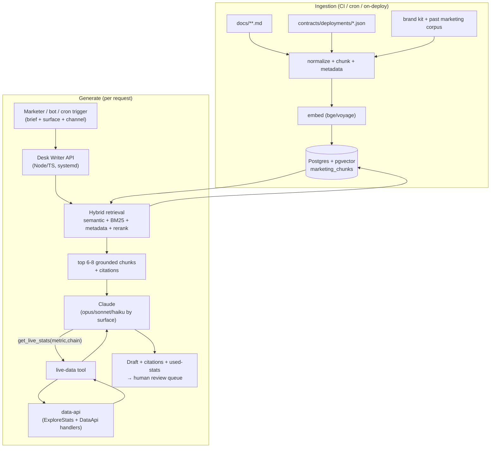

# HookSwap Marketing RAG — System Specification

> **Status:** Design / specification only. Nothing in this document is built yet.
> **Author:** Marketing-infra design pass · **Date:** 2026-07-18
> **Scope:** A retrieval-augmented generation (RAG) system that drafts on-brand,
> factually-grounded marketing content for HookSwap, wired to HookSwap's real
> docs and live on-chain stats.

This spec inherits HookSwap's **mandatory facts-only rule** (`CLAUDE.md`): *do not
guess, infer, or fabricate numbers, contract addresses, APYs, or claims.* A
marketing generator that hallucinates a TVL figure or a router address is a
**production defect**, not a stylistic miss. The entire architecture below exists
to make hallucinated facts structurally hard: static truth is retrieved from
versioned docs, and every live number is pulled through a tool call at generation
time — never recalled from the model's weights.

---

## 1. Goal & scope

### 1.1 Goal

Build an internal AI service — **"HookSwap Desk Writer"** — that generates
marketing and communications content that is:

1. **On-brand** — matches the HookSwap "Desk / Terminal" voice ("Trade on-chain
   like a desk, not a form", "A DEX in terminal form"), the Atlas/DAYSIGNAL
   palette, and the mono-numeric, no-hype tone established in
   `apps/web/src/terminal/screens/LandingScreen.tsx` and the `docs/` set.
2. **Factually grounded** — every product claim traces to a retrieved source
   chunk; every stat (TVL, 24h volume, pool count, fee tier, contract address,
   chain id) is either quoted from a versioned source or fetched live at
   generation time. No number is ever invented.
3. **Multi-surface** — one grounded core serves tweets/threads, blog posts,
   launch announcements, docs Q&A, and community/support replies.

### 1.2 In scope

- Content generation for: X/Twitter posts & threads, long-form blog/Mirror posts,
  launch & changelog announcements, docs Q&A answers, Discord/Telegram community
  replies, and short "weekly stats recap" auto-drafts.
- Retrieval over HookSwap's product docs, contract deployments, feature set,
  brand kit, FAQ, and past marketing copy.
- A **live-data tool** that reads the running data-api so generated content cites
  current, real numbers.
- Human-in-the-loop review before anything is published.

### 1.3 Out of scope (v1)

- Autonomous posting to any channel without human approval (Phase 3 adds
  scheduled auto-*drafts*, still gated by review).
- Financial advice, price predictions, yield promises — **hard-refused** by
  guardrails (§5), not merely discouraged.
- Image/video generation (the brand image assets are a separate design track;
  see the `A1/A2/A3` OG-asset notes in `CLAUDE.md`).
- Replacing the docs themselves — the RAG *reads* `docs/`, it is not the source
  of record.

### 1.4 Alignment with the facts-only rule

The facts-only rule is the product's north star, so the metric that dominates
evaluation (§8) is **zero hallucinated stats/addresses**. Where the honest answer
is "not live yet / no route / no liquidity," the system must say so — mirroring
the tone already shipped in `docs/users/faq.md` ("HookSwap does not fabricate
quotes — a missing route means there is genuinely nothing to route against") and
the landing page's honest "No price history yet — builds as trades occur" empty
states.

---

## 2. Knowledge sources & ingestion

### 2.1 Source inventory (all real, in-repo or live)

| # | Source | Location | Type | Freshness | Ingest as |
|---|--------|----------|------|-----------|-----------|
| S1 | User docs | `docs/users/*.md` (getting-started, swapping, liquidity, chains, faq) | Static | Per-commit | **Embed** |
| S2 | Developer docs | `docs/developers/*.md` (overview, routing, sdk, data-api, contract-addresses, launchpad-integration) | Static | Per-commit | **Embed** |
| S3 | Operator docs | `docs/operators/*.md` (deploy, indexer, routing, seed-liquidity, go-live-checklist) | Static (internal) | Per-commit | **Embed, internal-only** |
| S4 | Contract deployments | `contracts/deployments/*.json` (per chain: `<chain>.json`, `<chain>-suite.json`, `<chain>-lockers.json`, `<chain>-referral.json`) | Static (authoritative addresses) | Per-deploy | **Embed as structured facts** |
| S5 | Brand / voice kit | Distilled from `LandingScreen.tsx` copy + `terminal/theme/tokens`, taglines, `README.md`, palette in `CLAUDE.md` North Star | Static | Rare | **Embed + system-prompt** |
| S6 | Feature set / product map | `CLAUDE.md` workstreams + `terminal/config/screens` (Trade, Markets, Earn/Farms, Launch, Locker, Referrals, Airdrop, Multisender, upcoming Perps) | Static | Occasional | **Embed** |
| S7 | Past marketing content | Corpus of prior tweets/threads/blogs (seed folder `marketing-rag/corpus/voice/`) | Static | On-add | **Embed (voice exemplars)** |
| S8 | FAQ | `docs/users/faq.md` (already answers fees, chains, "is it live", audit stance) | Static | Per-commit | **Embed** |
| S9 | **Live protocol stats** | data-api `ExploreStatsService` — `dailyProtocolTvl`, `historicalProtocolVolume` (v2+v3) | **Dynamic** | Real-time | **Tool-fetch, never embed** |
| S10 | **Live token/pool stats** | data-api `DataApiService` — `listTokens` (price, 24h %), `listTopPools` (TVL, 24h vol, APR, sparkline) | **Dynamic** | Real-time | **Tool-fetch, never embed** |
| S11 | Changelog / release notes | git log + `CLAUDE.md` progress entries (feed launch-announcement drafting) | Semi-static | Per-release | **Embed on release** |

### 2.2 STATIC vs DYNAMIC — the core split

The single most important design decision: **anything that is a number the market
moves must be DYNAMIC (tool-fetched), never embedded.**

- **STATIC (embed → vector store):** docs prose, feature descriptions, brand voice,
  FAQ answers, and **contract addresses / chain ids / fee-tier definitions**
  (these change only on redeploy — a re-index event, not a per-request one).
- **DYNAMIC (retrieve live at generation time):** TVL, 24h volume, pool counts,
  token prices, 24h price change, per-pool APR. These are pulled through the
  live-data tool (§3.4) at the moment of generation, so a tweet published Tuesday
  never quotes Monday's TVL.

Rationale: embedding a stat freezes it. A weekly-recap tweet built from a
three-day-old embedded number is exactly the hallucination the facts-only rule
forbids. Fee tiers (0.30% v2; 0.01/0.05/0.30/1.00% v3) and addresses are stable
enough to embed but are re-indexed on every deploy so a chain migration can't
leave a stale address in circulation.

### 2.3 Ingestion pipeline

```
connectors → normalize → chunk (per-source strategy) → attach metadata
           → embed → upsert into pgvector (with content hash for idempotency)
```

**Connectors**

- `docs-connector` — walks `docs/**/*.md`, splits on Markdown headings.
- `deployments-connector` — reads `contracts/deployments/*.json`, emits one
  structured chunk per (chain, contract-role) pair.
- `corpus-connector` — reads `marketing-rag/corpus/voice/*.md|*.txt`.
- `changelog-connector` — reads tagged release notes / curated git log.
- Live stats are **not** connectors — they are a runtime tool (§3.4).

**Chunking strategy (per source)**

| Source | Strategy | Target size | Notes |
|--------|----------|-------------|-------|
| Docs (S1–S3, S8) | Heading-aware, recursive | 400–800 tokens, 15% overlap | Keep a heading breadcrumb (`Swapping › Fees`) in each chunk's text so retrieval and citations are self-describing. |
| Deployments (S4) | One chunk per contract role | ~1 short record | e.g. `Robinhood (4663) · Universal Router · 0x3D30133F4d4A80684F02d8310faF572E3dc193b3`. Never split an address across chunks. |
| Brand kit (S5) | Whole-section, no split | up to 1200 tokens | Voice must be retrieved intact; also mirrored into the system prompt. |
| Past marketing (S7) | One chunk per post | whole post | Retrieved as few-shot voice exemplars, tagged `doctype=voice_example`. |
| Changelog (S11) | One chunk per release entry | whole entry | Feeds launch-announcement drafting. |

**Metadata (attached to every chunk)**

```json
{
  "source": "docs/users/swapping.md",
  "doctype": "user_doc | dev_doc | operator_doc | deployment | brand | voice_example | faq | changelog",
  "chain": "robinhood | hyperevm | ink | megaeth | xlayer | tempo | sepolia | null",
  "chain_id": 4663,
  "audience": "public | internal",
  "product": "swap | launchpad | locker | farms | referrals | airdrop | multisender | perps | general",
  "updated_at": "2026-07-18",
  "content_sha256": "…",
  "heading_path": "Swapping > Fees"
}
```

`audience: internal` (operator docs, unreleased-feature notes) is filterable so a
public tweet never leaks an unshipped feature or an infra detail.

**Embeddings model** — see §3.2.

**Re-index cadence**

| Trigger | Action |
|---------|--------|
| CI on merge to the docs/contracts branch | Incremental re-index of changed files (content-hash diff → only re-embed changed chunks). |
| Contract deploy (new `deployments/*.json`) | Re-index S4 immediately — addresses must never be stale. |
| New marketing post added to corpus | Incremental upsert. |
| Nightly cron | Full-integrity sweep: re-hash everything, prune orphaned chunks, verify vector count. |
| Live stats (S9/S10) | **Never indexed** — always tool-fetched. |

---

## 3. Architecture

### 3.1 Recommendation summary (one line)

**pgvector on the existing VPS Postgres + a Node/TypeScript ingestion & API
service, hybrid retrieval (semantic + Postgres full-text BM25 + metadata filters)
with a rerank pass, and Claude (`claude-opus-4-8` for flagship, `claude-haiku-4-5`
for bulk drafts) as the generator, with a live-data tool that calls the running
data-api so every number is current.**

### 3.2 Vector store — pgvector, not Qdrant/Pinecone

**Recommendation: pgvector on the VPS's existing Postgres.**

Justification, grounded in HookSwap's actual infra (VPS `15.204.8.186`, systemd +
nginx + **Postgres + Redis already running**):

- **Zero new infra.** Postgres is already provisioned, backed up, and monitored on
  the VPS. Adding the `vector` extension is one `CREATE EXTENSION`. Qdrant or a
  self-hosted Milvus means a new service, new systemd unit, new backup story.
- **No new vendor / no data egress.** Pinecone is a hosted SaaS — it ships
  HookSwap's (some internal) content to a third party and adds a monthly bill and
  an API-key secret. HookSwap already self-hosts routing and data on principle
  ("full independence" — `CLAUDE.md`); the marketing brain should follow suit.
- **Hybrid in one query.** Postgres gives us `tsvector` BM25 **and** vector
  similarity in the *same* database, so hybrid retrieval (§3.3) is a single SQL
  statement with a metadata `WHERE` clause — no cross-store join, no second query
  planner.
- **Scale is tiny.** The entire corpus (docs + deployments + brand + a few hundred
  marketing posts) is low tens of thousands of chunks. pgvector with an HNSW index
  serves this in single-digit milliseconds; a dedicated vector DB is overkill.

When we'd revisit: if the corpus grows past ~1M chunks or we need multi-tenant
sharding, migrate to Qdrant. Not a v1 concern.

**Schema**

```sql
CREATE EXTENSION IF NOT EXISTS vector;

CREATE TABLE marketing_chunks (
  id            bigserial PRIMARY KEY,
  content       text        NOT NULL,
  embedding     vector(1024),            -- dim per §3.2 model choice
  source        text        NOT NULL,
  doctype       text        NOT NULL,
  chain         text,
  chain_id      integer,
  audience      text        NOT NULL DEFAULT 'public',
  product       text,
  heading_path  text,
  content_sha256 text       NOT NULL,
  updated_at    date        NOT NULL,
  tsv           tsvector GENERATED ALWAYS AS (to_tsvector('english', content)) STORED
);

CREATE INDEX ON marketing_chunks USING hnsw (embedding vector_cosine_ops);
CREATE INDEX ON marketing_chunks USING gin (tsv);
CREATE INDEX ON marketing_chunks (doctype, chain, audience, product);
```

**Embeddings model** — Claude does not expose a first-party embeddings endpoint,
so embeddings come from a dedicated model. **Recommendation: a self-hostable
open-weights embedding model (e.g. `bge-large-en-v1.5`, 1024-dim, or `nomic-embed-text`)
run on the VPS** — keeps the "self-hosted, no third-party data egress" posture and
avoids a per-embed API cost. If a hosted embedding API is preferred for quality,
Voyage (`voyage-3`) is the pragmatic choice; either way the dim is fixed in the
schema at index time and must match at query time. *(Finalize the exact model +
dim at build time; the schema's `vector(1024)` is a placeholder to adjust.)*

### 3.3 Retrieval — hybrid + metadata filter + rerank

Retrieval runs four stages:

1. **Metadata pre-filter** — `WHERE audience = 'public'` (unless internal surface),
   plus any `chain` / `product` narrowing inferred from the request ("write about
   the launchpad on Robinhood" → `product='launchpad' AND chain='robinhood'`).
2. **Semantic search** — cosine similarity on `embedding` (HNSW), top ~30.
3. **Keyword/BM25** — Postgres `ts_rank_cd(tsv, plainto_tsquery(...))`, top ~30.
   Critical for exact-match terms the embedder blurs: contract addresses, chain
   ids, `WHYPE`, `Permit2`, fee-tier strings.
4. **Fusion + rerank** — merge the two lists with Reciprocal Rank Fusion, then
   rerank the top ~20 with a cross-encoder reranker (self-hosted `bge-reranker` or
   a cheap Claude-Haiku relevance pass) down to the top **6–8** chunks that go into
   the prompt as grounded context.

Hybrid matters here specifically because marketing copy mixes fuzzy intent
("something punchy about our multi-chain reach") with must-be-exact facts (the
seven chain ids). Pure semantic search drops exact tokens; pure BM25 misses
paraphrase. Both, fused, cover both.

### 3.4 Generation — Claude + a live-data tool

**Generator model — Claude.** Per-use-case tiering (finalize exact model IDs and
pricing against the `claude-api` reference at build time — the strings below are
the current recommended defaults):

| Use case | Default model | Why |
|----------|---------------|-----|
| Flagship launch announcements, long-form blog | `claude-opus-4-8` | Highest quality; low volume, high stakes. Reputation-facing. |
| Docs Q&A, community replies, standard tweets | `claude-sonnet-5` | Strong quality at lower cost; the everyday workhorse. |
| Bulk drafts, weekly-recap auto-drafts, first-pass variants | `claude-haiku-4-5` | Cheapest; high volume; a human always reviews. |

Generation settings: **adaptive thinking** (`thinking: {type: "adaptive"}`) on the
Opus/Sonnet tiers for anything requiring synthesis; `effort` tuned per surface
(`high` for flagship, `low`/`medium` for bulk). **Stream** long outputs (blog
posts, threads) to avoid HTTP timeouts. Use **tool use** for the live-data tool
below, and **prompt caching** on the (large, stable) system prompt + brand kit
prefix so every draft reuses the cached brand context cheaply.

> Model IDs, pricing, thinking/effort semantics, and tool-use wiring must be
> confirmed against the bundled `claude-api` skill / reference at build time — it
> is the source of truth and supersedes any cached price in this doc.

**The live-data tool (the anti-hallucination keystone).** The LLM is given a tool
it *must* call before stating any current metric:

```jsonc
// Tool: get_live_stats
{
  "name": "get_live_stats",
  "description": "Fetch CURRENT HookSwap on-chain stats from the live data-api. Call this before stating any TVL, 24h volume, pool count, token price, price change, or APR. Never state such a number without calling this tool first.",
  "input_schema": {
    "type": "object",
    "properties": {
      "metric": { "type": "string",
        "enum": ["protocol_tvl", "protocol_volume_24h", "top_pools", "token_stats", "pool_count"] },
      "chain":  { "type": "string",
        "enum": ["robinhood","hyperevm","ink","megaeth","xlayer","tempo","sepolia","all"] },
      "limit":  { "type": "integer" }
    },
    "required": ["metric"]
  }
}
```

The tool handler is a thin server-side proxy to the **already-running data-api**
(`data.hookswap.org` / the Connect `ExploreStatsService` + `DataApiService`
handlers: `handleProtocolStats`, `handleListTopPools`, `handleListTokens`). It
returns real, current values (and honest empties). Because the model is instructed
(§5) to *only* state numbers returned by this tool, a stat in the output is
provably a stat that was live at generation time. If the tool returns empty (no
liquidity yet), the model must fall back to the honest "not live yet" framing, not
invent a figure.

Contract addresses use the same discipline but from the *static* side: they are
retrieved chunks (S4), and the model must quote the retrieved address verbatim,
never assemble one.

### 3.5 Request flow (ingest + query/generate)



---

## 4. Use cases / surfaces

Each surface is `input → retrieval → output`. All outputs land in a **review queue**
(§7) before anything leaves the building.

### 4.1 Content-generation dashboard (marketing team)

- **Input:** a brief — free text ("thread announcing farms are live on X Layer"),
  a surface type (tweet/thread/blog/announcement), a target channel, and optional
  chain/product scope.
- **Retrieval:** metadata-filtered (`product=farms, chain=xlayer, audience=public`)
  hybrid retrieval; live-data tool fetches XLayer TVL/top-pool stats.
- **Output:** 2–3 draft variants with inline citations and a "stats used" panel
  showing each live number and its data-api timestamp. Editable; regenerate per
  section.

### 4.2 Scheduled / auto-drafted content (weekly stats recap)

- **Input:** a cron trigger (e.g. Monday 14:00 UTC) with a fixed template intent:
  "weekly protocol recap."
- **Retrieval:** brand kit + recap template chunks; live-data tool pulls
  `protocol_tvl`, `protocol_volume_24h`, and `top_pools` for `all` chains and the
  7-day `dailyProtocolTvl` / `historicalProtocolVolume` series.
- **Output:** a drafted recap tweet/thread (numbers real, deltas computed from the
  live series), **queued for human approval** — never auto-posted in v1/v2. Uses
  `claude-haiku-4-5` (bulk tier).

### 4.3 Docs Q&A widget (docs.hookswap.org)

- **Input:** a visitor question ("What fee does a v3 pool charge?", "What's the
  Universal Router address on HyperEVM?").
- **Retrieval:** `audience=public` docs + deployments; hybrid so exact terms
  (addresses, fee tiers) hit via BM25.
- **Output:** a concise, cited answer that **quotes the doc/address verbatim** and
  refuses to speculate beyond retrieved context ("I don't have that in the docs" →
  link to the relevant page). Model: `claude-sonnet-5`. No live-stats tool needed
  unless the question is about current TVL/volume.

### 4.4 Community bot (Discord / Telegram)

- **Input:** a user message in a support channel, optionally @-mentioning the bot.
- **Retrieval:** same public docs + FAQ corpus; the FAQ's existing honest answers
  ("Is HookSwap live?", fees, chains, audit stance) are prime grounding.
- **Output:** a grounded reply in a friendlier, shorter register than the docs;
  hard guardrails (§5) block price/advice questions with a canned safe response and
  a docs link. Escalates to a human tag when confidence is low or the question is
  off-topic. Model: `claude-haiku-4-5` / `claude-sonnet-5`.

### 4.5 Launch-announcement drafting (from the changelog)

- **Input:** a release entry / changelog diff ("farms + locker went live on
  MegaETH; addresses in `megaeth-suite.json`").
- **Retrieval:** the changelog chunk (S11) + relevant deployment records (S4) +
  brand kit; live-data tool for any "already seeing $X TVL" claim (only if real).
- **Output:** a launch tweet + thread + short blog draft, addresses quoted from
  S4, framed in the Desk voice. Model: `claude-opus-4-8` (flagship tier).

---

## 5. Guardrails, brand & compliance

### 5.1 System-prompt shape

The system prompt (cached prefix, stable) has four blocks:

1. **Identity & voice** — "You are HookSwap Desk Writer. HookSwap is a self-hosted,
   multi-chain v2+v3 DEX styled as a trading *desk/terminal*, not a form. Voice:
   precise, quantitative, understated, no hype. Numbers in mono. Taglines you may
   echo: 'Trade on-chain like a desk, not a form', 'A DEX in terminal form'.
   Wordmark: Hook + green Swap." Plus the palette and the Inter/JetBrains-Mono /
   IBM-Plex-Mono type note for any design-adjacent copy.
2. **Product truth** — HookSwap is **v2 + v3 only. There are NO hooks and NO v4** —
   never claim hooks, v4, or features not in the retrieved context. Seven chains:
   Robinhood (4663), HyperEVM (999), Ink (57073), MegaETH (4326), X Layer (196),
   Tempo (4217), Sepolia (11155111). Products: swap, launchpad, locker, farms,
   referrals, airdrop, multisender; **Perps is upcoming — label it as such.**
3. **Hard factual constraints** (below).
4. **Compliance rails** (below).

> Note: "HookSwap" is aspirationally hook-branded, but the shipped product excludes
> hooks/v4 (LOCKED decision in `CLAUDE.md`). The prompt must prevent the model from
> "helpfully" inventing hook features from the name.

### 5.2 Hard factual constraints

- **State only facts present in the retrieved context or returned by a tool.** If a
  claim isn't grounded, don't make it. When unsure, say so.
- **Never invent or approximate a statistic** (TVL, volume, APY, price, pool count,
  fees). Every current number must come from a `get_live_stats` call in this turn.
  Fee tiers may be quoted from docs (0.30% v2; 0.01/0.05/0.30/1.00% v3).
- **Never invent, complete, or "correct" a contract address or chain id.** Quote
  the retrieved deployment record verbatim, or say you don't have it.
- **No stat without a tool call, no address without a retrieval.** If the tool
  returns empty (pre-liquidity), use HookSwap's honest framing ("not live yet / no
  route / builds as trades occur") — never a placeholder number.
- **Cite sources** (§5.4).

### 5.3 Compliance rails (hard-refuse)

- **No financial or investment advice.** No "buy", "you should", "great entry",
  allocation guidance.
- **No price predictions / targets / speculation** on token value.
- **No yield/return promises.** APRs, when shown, are the live per-pool figure with
  a "variable, not a promise" qualifier — never framed as guaranteed income.
- **Honest about stage.** HookSwap is early: liquidity is thin/seeded, some pairs
  have no route yet. The FAQ's honesty ("does not fabricate quotes") is the tone —
  do not oversell readiness.
- **No security/audit claims.** HookSwap does not publish an independent audit
  (`faq.md`) — never imply "audited/safe". These trigger a canned safe response +
  human escalation, never a generated answer.

Compliance is enforced twice: in the system prompt, and by a **post-generation
validator** (§7) that regex/pattern-scans drafts for advice language, unqualified
APY promises, and any stat/address not in the turn's tool results + retrieved set —
flagging violations for human review before the draft is releasable.

### 5.4 Citation / source-attribution requirement

Every generated artifact carries a machine-readable attachment:

```jsonc
{
  "claims": [
    { "text": "0.30% flat on v2 pools", "source": "docs/users/faq.md#fees" },
    { "text": "Universal Router 0x3D30…93b3 on Robinhood",
      "source": "contracts/deployments/robinhood.json" }
  ],
  "live_stats": [
    { "metric": "protocol_tvl", "chain": "all", "value": "…",
      "fetched_at": "2026-07-18T14:00:03Z", "source": "data-api/ExploreStats" }
  ]
}
```

Reviewers see citations inline; the docs-Q&A and community surfaces render a
"Sources" footer. A draft with an **uncited factual claim fails validation.**

---

## 6. Tech stack & repo shape

### 6.1 Stack (reuse HookSwap's patterns)

- **Language/runtime:** **Node.js + TypeScript** — matches the data-api,
  gateway-adapter, and trading-api-adapter services already on the VPS. Same
  tooling (bun/pnpm), same deploy muscle-memory, same Connect/Express patterns.
- **LLM:** Anthropic SDK (`@anthropic-ai/sdk`), Claude models per §3.4.
- **Vector store:** Postgres + `pgvector` (existing VPS Postgres).
- **Cache/queue:** existing VPS **Redis** — retrieval cache, live-stats short-TTL
  cache (~30–60s so a burst of drafts doesn't hammer the data-api), and the review
  queue's job state.
- **Embeddings/rerank:** self-hosted `bge-large-en-v1.5` + `bge-reranker` (or a
  hosted embedding API — decide at build time).
- **API:** Express (or Connect, to match data-api). **Dashboard (optional, Phase
  3):** a small React/Vite app, or reuse the existing web toolchain.
- **Process mgmt / serving:** **systemd unit + nginx** reverse proxy — identical to
  how `hookswap-trading-api.service` and the data-api are already run on the VPS.

### 6.2 Proposed directory layout

```
marketing-rag/
├── README.md
├── package.json
├── src/
│   ├── server.ts              # HTTP API (systemd entrypoint)
│   ├── config.ts              # env + model tiers + data-api base URL
│   ├── ingest/
│   │   ├── connectors/        # docs, deployments, corpus, changelog
│   │   ├── chunk.ts           # per-source chunking (§2.3)
│   │   ├── embed.ts
│   │   └── index.ts           # CLI: `marketing-rag ingest [--full|--changed]`
│   ├── retrieval/
│   │   ├── hybrid.ts          # semantic + BM25 + RRF + metadata filter
│   │   └── rerank.ts
│   ├── generate/
│   │   ├── claude.ts          # model tiering, streaming, prompt cache
│   │   ├── prompts/           # system prompt blocks, per-surface templates
│   │   └── tools/liveStats.ts # get_live_stats → data-api proxy
│   ├── guardrails/
│   │   ├── validator.ts       # post-gen fact/compliance/citation scan
│   │   └── policies.ts
│   ├── surfaces/              # dashboard-api, docs-qa, community-bot, scheduler
│   └── review/                # review queue + approval state (Redis/Postgres)
├── corpus/voice/              # past marketing content (S7)
├── db/migrations/             # pgvector schema (§3.2)
├── deploy/
│   ├── marketing-rag.service  # systemd unit
│   ├── nginx.conf             # marketing.hookswap.org (internal-only)
│   └── ingest.cron            # nightly full re-index
└── test/
    └── eval/                  # golden Q&A + hallucination harness (§8)
```

### 6.3 Env / secrets (VPS `.env`, gitignored — matches existing services)

```
ANTHROPIC_API_KEY=…             # generation
DATABASE_URL=postgres://…       # existing VPS Postgres + pgvector
REDIS_URL=redis://…             # existing VPS Redis
DATA_API_BASE_URL=https://data.hookswap.org   # live-stats tool target
EMBEDDINGS_MODE=selfhost|voyage
VOYAGE_API_KEY=…                # only if hosted embeddings
DISCORD_BOT_TOKEN=…             # Phase 3
TELEGRAM_BOT_TOKEN=…            # Phase 3
```

Rotate any keys shared in chat (the same discipline `CLAUDE.md` already applies to
the Infura key).

### 6.4 Deploy on the VPS

- **API service:** `marketing-rag.service` (systemd), bound to `127.0.0.1:409x`,
  fronted by nginx. Default **internal-only** (the marketing team + the docs-Q&A
  origin) — expose `marketing.hookswap.org` behind auth, not a public open
  endpoint. The docs-Q&A widget and community bots call it server-side.
- **Ingestion:** a `marketing-rag ingest` CLI run by (a) a CI hook on docs/contract
  merges, (b) a post-deploy hook when `deployments/*.json` changes, and (c) a
  nightly cron for the integrity sweep.
- **Scheduler:** the weekly-recap auto-draft is a cron that hits the API and drops
  the result in the review queue.
- **TLS:** certbot, same as the other subdomains.

This adds one systemd service and one nginx location to a VPS that already runs
exactly this shape (systemd + nginx + Postgres + Redis) — no new infrastructure
class.

---

## 7. Phased delivery plan

### Phase 1 — Grounded drafting + docs Q&A (foundation)

- Stand up pgvector schema + ingestion for **docs (S1–S3, S8), deployments (S4),
  brand kit (S5), FAQ, feature set (S6)**.
- Hybrid retrieval + rerank; Claude generation with the tiered models and the
  **system-prompt guardrails + post-gen validator**.
- Ship: **content-generation dashboard** (drafts with citations) and the **docs
  Q&A** answer endpoint (static grounding, no live stats yet).
- Human review queue in place from day one.
- **Deliverable:** on-brand, cited drafts + accurate docs answers. No live numbers
  yet (numbers deferred to Phase 2).
- **Reusable now:** VPS Postgres/Redis, the data-api's doc set, the FAQ's honest
  voice, the systemd+nginx deploy pattern.
- **Blockers:** `ANTHROPIC_API_KEY`; embeddings model decision; a seed of past
  marketing posts (S7) for voice.

### Phase 2 — Live-data grounding + scheduled content

- Build the **`get_live_stats` tool** → data-api proxy (ExploreStats + DataApi
  handlers) with a Redis short-TTL cache.
- Wire it into generation so tweets/blogs cite **current TVL/volume/pool/APR**;
  enforce "no stat without a tool call" in the validator.
- Ship the **weekly stats-recap auto-draft** (cron → review queue).
- **Deliverable:** content that quotes real, current on-chain numbers — and
  honestly says "not live yet" when the tool returns empty.
- **Blockers:** stable data-api reachability from the VPS service; agreement that
  auto-drafts stay review-gated (no auto-post yet).

### Phase 3 — Multi-channel bots + analytics/feedback loop

- **Discord/Telegram community bots** grounded in public docs + FAQ, with
  escalation + hard compliance refusals.
- **Docs Q&A widget** embedded on docs.hookswap.org.
- **Feedback loop:** capture reviewer edits + accept/reject + engagement signals;
  use them to (a) tune retrieval (which chunks actually get cited), (b) grow the
  voice corpus from approved posts, (c) report the §8 metrics.
- Optional lightweight React dashboard.
- **Blockers:** channel bot tokens/hosting; a decision on whether the docs widget
  is public (rate-limit + abuse protection needed if so).

---

## 8. Evaluation & metrics

### 8.1 Factual accuracy — the primary metric (target: zero hallucinated facts)

- **Hallucinated-stat rate** — % of drafts containing a numeric stat NOT present in
  that turn's `get_live_stats` results. **Target: 0%.** Automated: the validator
  extracts every number/percentage/`$`-figure from the draft and diffs it against
  tool outputs + retrieved fee tiers; any unmatched number fails.
- **Hallucinated-address rate** — % of drafts with a contract address / chain id
  not present verbatim in the retrieved deployment set. **Target: 0%.** Automated
  regex extraction + exact-match check against S4.
- **Unfounded-claim rate** — sampled human audit: does every factual sentence trace
  to a citation? Target < 1% unfounded.
- **Golden test set** — a fixed suite of briefs/questions with known-correct
  answers (fees, addresses, chain list, "is it live") run in CI on every prompt or
  index change; a regression blocks release.

### 8.2 Retrieval quality

- **Recall@k / hit-rate** — for the golden set, is the source chunk that contains
  the answer in the top-k retrieved? Target hit-rate > 0.95 at k=8.
- **Citation-precision** — of chunks cited in output, what fraction were actually
  relevant (human-rated on a sample).
- **Empty-handling correctness** — when the answer isn't in the corpus / the stat
  tool is empty, does the system correctly say "I don't have that / not live yet"
  instead of confabulating? Measured on an adversarial subset.

### 8.3 Brand-voice adherence

- **Rubric scoring** — an LLM-judge (separate Claude call) plus periodic human
  spot-check scores drafts against a voice rubric (Desk tone, no hype, mono
  numbers, no banned hook/v4 claims, correct taglines). Track the score
  distribution over time.
- **Banned-claim scan** — automated: any mention of "hooks", "v4", "audited",
  price prediction, or advice language is an automatic voice/compliance fail.

### 8.4 Human-in-the-loop review

- **Nothing publishes without approval** (v1–v2). Track: approval rate, edit
  distance between draft and published (lower = better first drafts), and time-to-
  approve. Rising approval rate + falling edit distance = the system is learning
  the voice.

### 8.5 Engagement (Phase 3, downstream)

- For published content: impressions, engagement rate, click-through to
  docs/app, and docs-Q&A "was this helpful" votes. These tune *what* to write, not
  whether facts are correct — accuracy metrics (§8.1) always dominate; an engaging
  post with a wrong number is a failure, not a success.

---

## Appendix A — Grounding references (verified in-repo)

- Brand/voice & facts-only rule: `CLAUDE.md` (North Star, LOCKED DECISIONS,
  MANDATORY WORKING RULE), `apps/web/src/terminal/screens/LandingScreen.tsx`
  (Desk voice, honest empty states, live data bindings).
- Live stats available: data-api `handlers.ts` (`handleListTokens`,
  `handleListTopPools`, `handleGetPortfolio`, `handleListTransactions`,
  `handleListPositions`, `handleGetWalletBalances`) and `exploreStatsHandlers.ts`
  (`handleProtocolStats` → `dailyProtocolTvl`, `historicalProtocolVolume`).
- Chains, fees, "is it live" honesty: `docs/users/faq.md`, `docs/users/chains.md`.
- Routing/architecture truth (self-hosted Trading API, no v4): `docs/developers/overview.md`.
- Contract addresses (authoritative): `contracts/deployments/<chain>.json`,
  `<chain>-suite.json`, `<chain>-lockers.json`, `<chain>-referral.json`
  (e.g. Robinhood Universal Router `0x3D30133F4d4A80684F02d8310faF572E3dc193b3`,
  WETH `0x0Bd7D308f8E1639FAb988df18A8011f41EAcAD73`, WETH/USDG anchor pool
  `0xF7ddC3837eAF447689a365f5f6f6B7C2AcdB72D7`).
- Infra to reuse: VPS `15.204.8.186`, systemd + nginx + Postgres + Redis,
  `data.hookswap.org`, `trading.hookswap.org`, `docs.hookswap.org` (`CLAUDE.md`
  VPS deploy notes).

> Model IDs, pricing, and Claude API feature semantics in §3.4 are the current
> recommended defaults and **must be re-confirmed against the `claude-api`
> reference at build time**, which is authoritative over any value cached here.
